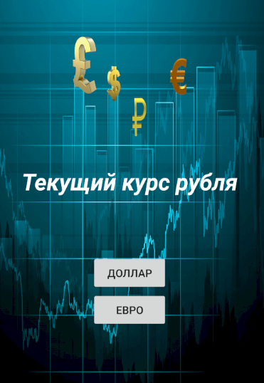
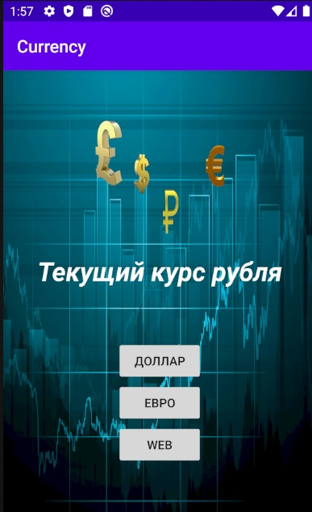
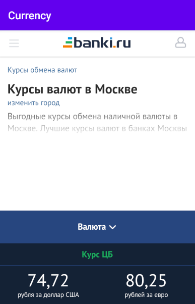

# Currency
The app shows the current exchange rate of the USD and Euro against the ruble.

This application was created by the rule of one activity.

The following technologies are used:

-retrofit.2

-json

-restful api

-multithreading
